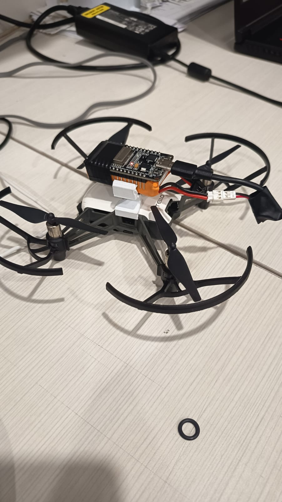
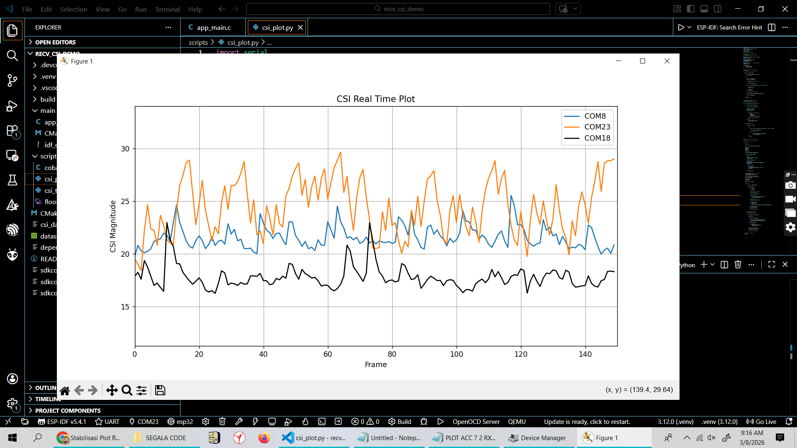
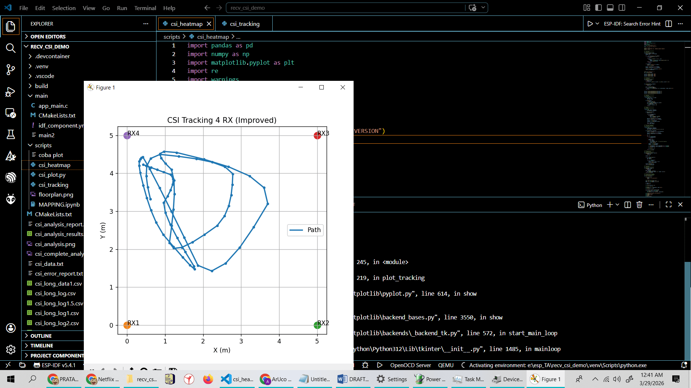

# SISTEM-TAKE-OFF-LANDING
Sistem take off landing drone yang menggunakan 2 metode untuk identifikasi lokasi landing pad yaitu, Aruco dan CSI. Aruco di identifikasi melalui kamera dari drone memanfaatkan YOLO dan machine learning untuk mencari aruco marker dan juga menghitung jarak. Lalu, CSI yang memanfaatkan koneksi ESP-NOW untuk memetakan lokasi landing pad, dilihat dari pantulan gelombang pada landing pad. Digunakan Aruco, untuk memanfaatkan kamera dari drone, dan digunakan CSI karena sifatnya yang ringan dan realtime sehingga proses pemetaan tidak memberatkan daya terbang dari drone Tello. 

